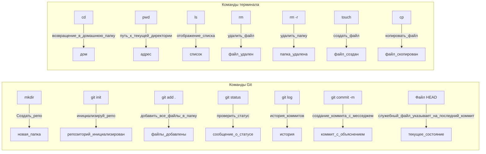

```mermaid
graph LR;

subgraph "Команды Git"
  C[mkdir] -- "Создать_репо" --> D[новая_папка];
  A[git init] -- "инициализируй_репо" --> B[репозиторий_инициализирован];
  E[git add .] -- "добавить_все_файлы_в_папку" --> F[файлы_добавлены];
  G[git status] -- "проверить_статус" --> H[сообщение_о_статусе];
  I[git log] -- "история_коммитов" --> J[история];
  K[git commit -m] -- "создание_коммита_с_месседжем" --> L[коммит_с_объяснением];
  M[Файл HEAD] -- "служебный_файл_указывает_на_последний_коммит" --> N[текущее_состояние];
end

subgraph "Команды терминала"
  O[cd] -- "возвращение_в_домашнюю_папку" --> P[дом];
  Q[pwd] -- "путь_к_текущей_директории" --> R[адрес];
  S[ls] -- "отображение_списка" --> T[список];
  U[rm] -- "удалить_файл" --> V[файл_удален];
  W[rm -r] -- "удалить_папку" --> X[папка_удалена];
  Y[touch] -- "создать_файл" --> Z[файл_создан];
  AA[cp] -- "копировать_файл" --> AB[файл_скопирован];
end


```

